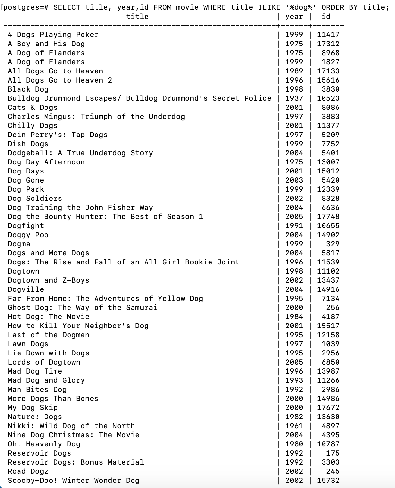
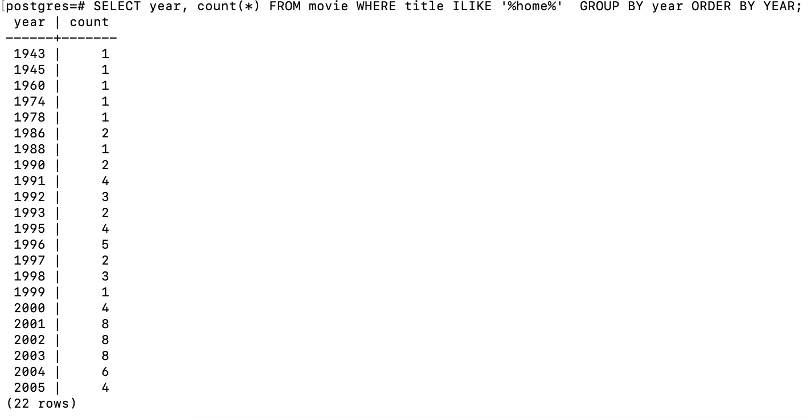
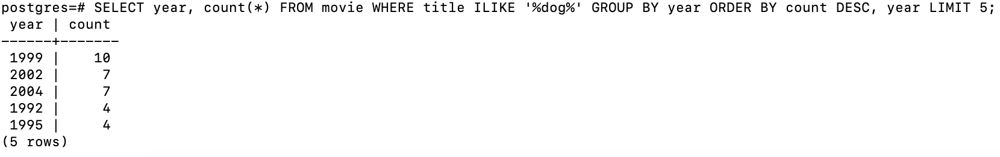
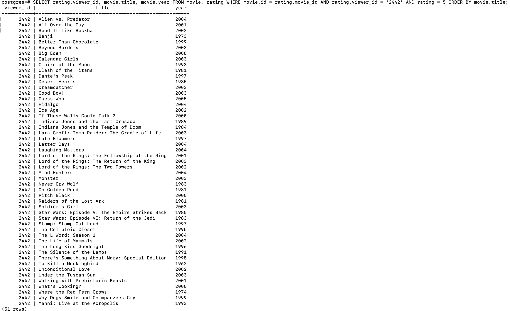
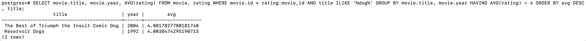
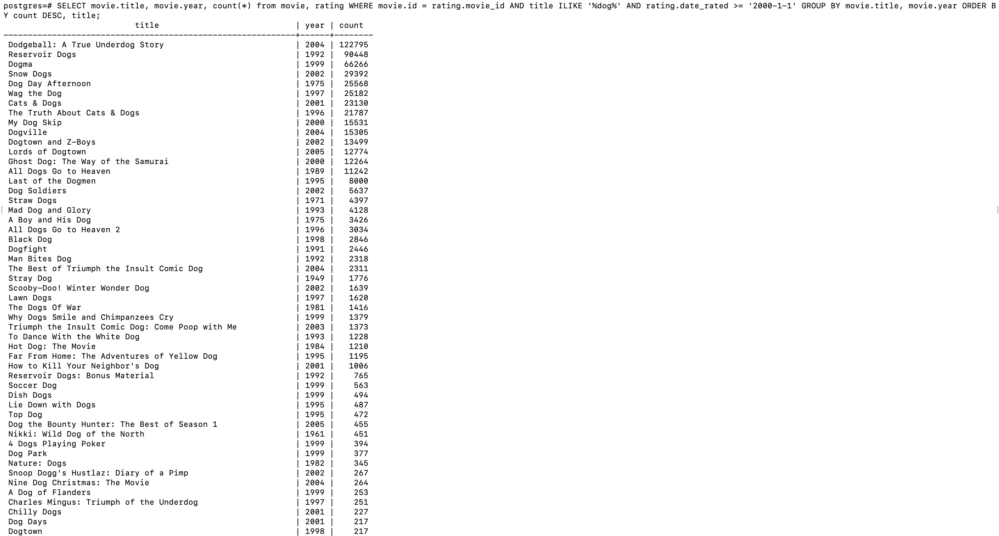

# Practice Problems

1. Movies filtered by title and/or year: A query that retrieves the ID, year, and title of movies that fit criteria of your choosing (e.g., movies with certain titles or title patterns, movies released on one or more given years, etc.), sorted ascending by title.

```sql
SELECT title, year,id FROM movie WHERE title ILIKE '%dog%' ORDER BY title;
```

_Movies ordered by title with dog (case insensitive) somewhere in the title_

<center></img></center>

2. Number of movies released per year: A query that takes movie criteria of your choosing and returns a table consisting of year and count where count is the number of movies that meet these criteria which were released on that year, sorted ascending by year

```sql
SELECT year, count(*) FROM movie WHERE title ILIKE '%home%'  GROUP BY year ORDER BY year;
```

_How many movies came out in any year with the word 'home' in the title (case insensitive)_

<center></img></center>

3. Years with the most movies released: A query that takes movie criteria of your choosing and returns the same table as above except it only returns the year and count of the top five (5) years with the most movies released, sorted descending by count then ascending by year in case of a tie.

```sql
SELECT year, count(*) FROM movie WHERE title ILIKE '%dog%' GROUP BY year ORDER BY count DESC, year LIMIT 5;
```

_The top 5 years that movie titles, with the word dog (case insensitive), were released in, in descending order
by count_

<center></img></center>

4. Movies rated a certain way by a specific user: A query that lists the title and year of movies seen by a particular user with a rating matching conditions of your choosing (e.g., 4 and above, 2 and below, etc.) sorted ascending by title.

```sql
SELECT rating.viewer_id, movie.title, movie.year FROM movie, rating WHERE movie.id = rating.movie_id AND rating.viewer_id = '2442' AND rating = 5 ORDER BY movie.title;
```

_Movies user 2442 rated a 5 in A-Z ordered by movie titles_

<center></img></center>

5. Average rating of movies: A query that takes movie criteria of your choosing and returns a table consisting of title, year, and avg where avg is the average rating received by each movie, sorted descending by avg (thus listing the top-rated movie first) then ascending by title in case of a tie.

```sql
SELECT movie.title, movie.year, AVG(rating) FROM movie, rating WHERE movie.id = rating.movie_id AND title ILIKE '%dog%' GROUP BY movie.title, movie.year ORDER BY avg DESC, title;
```

_Movies with the the word dog in the title's (case insensitive) ratings averaged out, and then ordered by average from highest to lowest_

<center></img></center>

6. Specific average rating of movies: A query that takes movie criteria of your choosing and returns a table consisting of title, year, and avg where avg is the average rating received by each movie and meeting some condition of your choosing such as average greater than 4, average less than 3, etc.—the results should be sorted descending by avg (thus listing the top-rated movie first) then ascending by title in case of a tie.

```sql
SELECT movie.title, movie.year, AVG(rating) FROM movie, rating WHERE movie.id = rating.movie_id AND title ILIKE '%dog%' GROUP BY movie.title, movie.year HAVING AVG(rating) > 3 ORDER BY avg DESC, title;
```

_Same as the criteria above, but only list if the average rating is >= 4_

<center></img></center>

7. Number of reviews received by a movie during a certain time period: A query that takes movie criteria of your choosing and returns a table consisting of title, year, and count where count is the number of reviews received by each movie within a particular date range of your choosing such as after 2005, during the month of September, etc.—the results should be sorted descending by count (thus listing the most-frequently-rated movie first) then ascending by title in case of a tie.

```sql
SELECT movie.title, movie.year, count(*) from movie, rating WHERE movie.id = rating.movie_id AND title ILIKE '%dog%' AND rating.date_rated >= '2000-1-1' GROUP BY movie.title, movie.year ORDER BY count DESC, title;
```

_How many reviews were given by users after January 1st, 2000, in a table with the title and release year of a movie_

<center></img></center>
