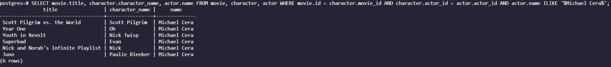
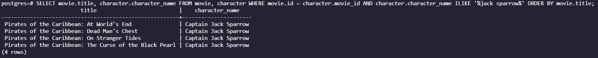
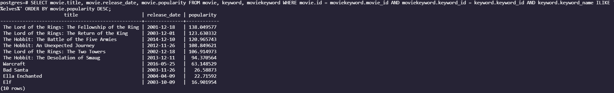
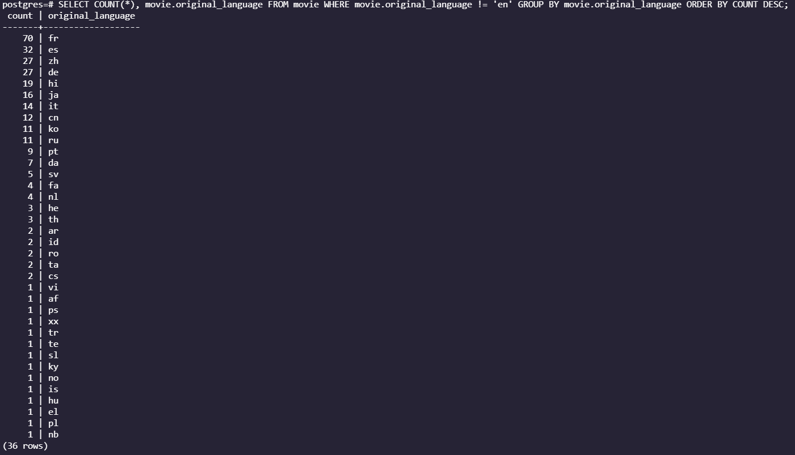
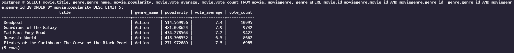
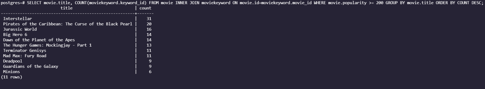
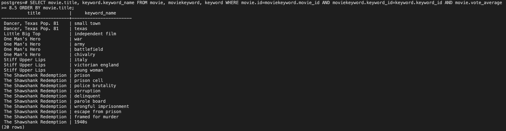

# Queries

1. The title, character name, and actor name of all the movies Michael Cera is in within our dataset.

```sql
SELECT movie.title, character.character_name, actor.name FROM movie, character, actor WHERE movie.id = character.movie_id AND character.actor_id = actor.actor_id AND actor.name ILIKE '%Michael Cera%';
```

<center></img></center>

2. All the movies with the character name like "jack sparrow" in our dataset given in a table with the title and name of character.

```sql
SELECT movie.title, character.character_name FROM movie, character WHERE movie.id = character.movie_id AND character.character_name ILIKE '%jack sparrow%' ORDER BY movie.title;
```

<center></img></center>

3. All the movies attributed with the keyword "elves" in descending order by popularity.

```sql
SELECT movie.title, movie.release_date, movie.popularity FROM movie, keyword, moviekeyword WHERE movie.id = moviekeyword.movie_id AND moviekeyword.keyword_id = keyword.keyword_id AND keyword.keyword_name ILIKE '%elves%' ORDER BY movie.popularity DESC;
```

_uses order by_

<center></img></center>

4. A count of all the movies whose original language is not english sorted by the count in descending order.

```sql
SELECT COUNT(*), movie.original_language FROM movie WHERE movie.original_language != 'en' GROUP BY movie.original_language ORDER BY COUNT DESC;
```

_uses group by count and order by_

<center></img></center>

5. The top 5 most popular movies under the action genre in descending order. We select a table with the title of the movie, the genre, the popularity, the vote average, and the vote count.

```sql
SELECT movie.title, genre.genre_name, movie.popularity, movie.vote_average, movie.vote_count FROM movie, moviegenre, genre WHERE movie.id=moviegenre.movie_id AND moviegenre.genre_id =genre.genre_id AND moviegenre.genre_id=28 ORDER BY movie.popularity DESC LIMIT 5;
```

_uses limit_

<center></img></center>

6. A count of how many keywords the movies with a popularity rating of over 200 have, then ordered by the count in descending order.

```sql
SELECT movie.title, COUNT(moviekeyword.keyword_id) FROM movie INNER JOIN moviekeyword ON movie.id=moviekeyword.movie_id WHERE movie.popularity >= 200 GROUP BY movie.title ORDER BY COUNT DESC;
```

_uses inner join_

<center></img></center>

7. All of the keywords attributed to movies with a voter average of 8.5 and up sorted by title.

```sql
SELECT movie.title, keyword.keyword_name FROM movie, moviekeyword, keyword WHERE movie.id=moviekeyword.movie_id AND moviekeyword.keyword_id=keyword.keyword_id AND movie.vote_average>= 8.5 ORDER BY movie.title;
```

<center></img></center>
